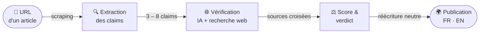

<div align="center">

<!-- Banner généré dynamiquement depuis la DB — se met à jour à chaque publication d'article. -->
<a href="https://unbunked.news">
  
</a>

<br /><br />

**Le fact-checking de l'actualité, vérifié affirmation par affirmation.**

<br />

<!-- Stack badges -->


<br />

<!-- CTA button -->
<a href="https://unbunked.news">
  
</a>

<br /><br />

</div>

---

## Pourquoi Unbunked ?

L'information circule vite. Les vérifications, moins.

**Unbunked** ne donne pas un simple vrai/faux. Il décompose chaque article en affirmations vérifiables, les confronte une à une à des sources indépendantes via recherche web, puis publie un verdict documenté — avec score, raisonnement, et sources consultées visibles par tous.

Bilingue (FR/EN). Méthodologie publique. Zéro opinion.

---

## Comment ça marche



Chaque phase est indépendante. Chaque claim porte ses propres sources. Le raisonnement est entier, pas un résumé.

---

## Les verdicts

<div align="center">

| Verdict | Score | Signification |
|:-------:|:-----:|---------------|
|  | 85 – 100 | Affirmation solide, bien sourcée et conforme aux faits |
|  | 60 – 84 | Globalement vrai, mais incomplet ou dépendant du contexte |
|  | 40 – 59 | Fiabilité fragile : réserves importantes sur les faits ou les sources |
|  | 0 – 39 | Affirmation fausse ou trompeuse |
|  | — | Sources insuffisantes pour trancher |

</div>

> **Verdict automatique "Faux"** — indépendamment du score, quatre situations déclenchent un verdict *Faux* immédiat : fabrication détectée, usurpation de domaine, affirmation centrale contredite par les sources, ou contenu généré par IA avec erreurs non déclarées.

---

## La méthode

> **Les preuves d'abord.** Chaque évaluation s'appuie sur des sources consultées, jamais sur des intuitions. Le raisonnement complet est visible — n'importe qui peut refaire le chemin.

> **Rigueur, pas opinion.** La plateforme évalue la solidité journalistique, pas l'orientation politique. L'orientation éditoriale est signalée séparément (neutre · orienté · militant) et n'entre jamais dans le score.

> **Assumer le doute.** Quand les sources ne permettent pas de conclure, le verdict est *Non vérifiable* — pas un chiffre inventé.

<details>
<summary>Voir les 6 critères d'évaluation et leurs poids</summary>

<br />

| Critère | Poids | Ce qui est mesuré |
|---------|:-----:|------------------|
| **Exactitude** | 30 % | Chiffres, dates, citations — sont-ils corrects ? |
| **Recoupement** | 25 % | Les faits sont confirmés par ≥ 2 sources indépendantes ? |
| **Sources citées** | 18 % | Les références sont nommées, vérifiables, indépendantes ? |
| **Contexte** | 12 % | Des faits essentiels sont omis de façon trompeuse ? |
| **Transparence** | 10 % | Auteur, date, éditeur, financements identifiables ? |
| **Fraîcheur** *(conditionnel)* | 5 % | L'info est à jour ? *(renormalisé si non applicable)* |

Les poids sont fixes et publics. Le score global est la moyenne pondérée, calculée par le code — jamais par l'IA.

</details>

---

## En chiffres

<!-- Carte stats dynamique — générée depuis la DB via /api/readme/stats -->
<div align="center">
  <a href="https://unbunked.news">
    
  </a>
</div>

---

## Dernières analyses

<!-- Carte dynamique — mise à jour automatique depuis la DB via /api/readme/latest -->
<div align="center">
  <a href="https://unbunked.news">
    
  </a>
</div>

---

## Galerie

<!-- PLACEHOLDER — captures d'écran du site réel
     Dimensions recommandées : 1200×750 px, format PNG ou WebP
     Chemins : docs/screenshot-feed.png, docs/screenshot-article.png,
               docs/screenshot-claim.png, docs/screenshot-admin.png     -->

<table>
  <tr>
    <td align="center" width="50%">
      <br />
      <sub><b>Feed public</b> — les dernières analyses</sub>
    </td>
    <td align="center" width="50%">
      <br />
      <sub><b>Analyse</b> — claims surlignées dans le texte</sub>
    </td>
  </tr>
  <tr>
    <td align="center" width="50%">
      <br />
      <sub><b>Fiche claim</b> — verdict + sources + raisonnement</sub>
    </td>
    <td align="center" width="50%">
      <br />
      <sub><b>Admin</b> — révision avant publication</sub>
    </td>
  </tr>
</table>

---

## Participer

- **Proposer un article** : [unbunked.news/submit](https://unbunked.news/submit) — coller une URL, c'est tout.
- **Signaler une erreur** : chaque analyse publiée accepte des suggestions de correction ou de sources complémentaires.

<div align="center">
<br />

<a href="https://unbunked.news/submit">
  
</a>

<br /><br />
</div>

---

---

## Le dépôt

### Stack technique

| Couche | Technologie |
|--------|-------------|
| **Framework** | Next.js 16 (App Router, Turbopack) · React 19 · TypeScript |
| **Frontend** | Tailwind CSS v4 · shadcn/ui · thème clair/sombre |
| **Internationalisation** | next-intl (FR/EN) |
| **Base de données** | PostgreSQL 16 · Drizzle ORM |
| **Authentification** | BetterAuth (email/mot de passe, admin uniquement) |
| **IA** | Anthropic SDK (Claude) · web search tool |
| **Scraping** | `@extractus/article-extractor` · Puppeteer (repli) |
| **Infra** | Docker Compose (local) · Kubernetes (production) |
| **Emails** | Resend · Nodemailer |
| **Package manager** | pnpm |

### Prérequis

- Node.js 20+
- pnpm
- Docker (pour PostgreSQL en local)
- Une clé API Anthropic (`ANTHROPIC_API_KEY`)

### Démarrage rapide (développement local)

```bash
# 1. Dépendances
pnpm install

# 2. Variables d'environnement
cp .env.example .env
```

Ouvre `.env` et renseigne au minimum :

| Variable | Valeur |
|---|---|
| `ANTHROPIC_API_KEY` | ta clé API Anthropic |
| `BETTER_AUTH_SECRET` | `$(openssl rand -base64 32)` |

```bash
# 3. Lancer Postgres + appliquer les migrations
docker compose up -d db
pnpm db:migrate

# 4. Créer le premier compte admin
pnpm db:seed-admin "toi@exemple.com" "un-mot-de-passe-fort"
# Sans mot de passe : génération automatique (affichée en sortie)
pnpm db:seed-admin "toi@exemple.com"
# Reset mot de passe d'un compte existant (+ promotion admin)
pnpm db:seed-admin "toi@exemple.com" --reset-password

# 5. Démarrer l'app
pnpm dev
```

L'application est disponible sur **http://localhost:3030**.

En local, `pnpm dev` tourne en mode **`hybrid`** : le même process sert le HTTP et exécute la pipeline IA. Voir [Rôles d'exécution](#rôles-dexécution) pour séparer web et worker en production.

### Pages principales

| Page | URL |
|------|-----|
| Feed public | `http://localhost:3030/` |
| Proposer un article | `http://localhost:3030/submit` |
| Connexion admin | `http://localhost:3030/login` |
| Administration | `http://localhost:3030/admin` |

### Flux type

1. Se connecter sur `/login` avec les identifiants du seed.
2. Aller sur `/admin/submit`, coller l'URL d'un article.
3. Suivre l'avancement (scrape → extraction → vérification → agrégation → réécriture multilingue).
4. Réviser le brouillon (titre, résumé, verdict, score, réécritures), puis **Publier**.
5. L'article apparaît sur le feed `/`.

---

### Stack complet avec Docker Compose

```bash
docker compose up --build
```

Seed admin dans le conteneur :

```bash
docker compose exec app sh -c \
  'pnpm db:seed-admin "toi@exemple.com" "mot-de-passe-fort"'
```

Adminer (inspecteur DB) :

```bash
docker compose --profile tools up adminer
# → http://localhost:8090
```

---

### Scripts

| Commande | Description |
|----------|-------------|
| `pnpm dev` | Serveur de développement (Turbopack) |
| `pnpm build` | Build de production |
| `pnpm start` | Sert le build de production |
| `pnpm lint` | ESLint |
| `pnpm db:generate` | Génère une migration depuis le schéma Drizzle |
| `pnpm db:migrate` | Applique les migrations en attente |
| `pnpm db:seed-admin "email" ["password"] [--reset-password]` | Crée/promeut le compte admin |
| `pnpm db:studio` | Ouvre Drizzle Studio |

---

### Variables d'environnement

Toutes les variables sont documentées dans `.env.example`.

| Variable | Requis | Description |
|----------|--------|-------------|
| `DATABASE_URL` | oui | Connexion PostgreSQL |
| `ANTHROPIC_API_KEY` | oui | Clé API Anthropic |
| `BETTER_AUTH_SECRET` | oui | Secret des sessions (`openssl rand -base64 32`) |
| `BETTER_AUTH_URL` | oui | URL publique de l'app |
| `APP_ROLE` | non | `web`, `worker` ou `hybrid` (défaut) |
| `DATABASE_POOL_MAX` | non | Connexions max du pool Postgres par process (défaut 10) |
| `APP_PORT` / `DB_PORT` / `ADMINER_PORT` | non | Ports du stack Docker (défauts 3030/5434/8090) |
| `ANTHROPIC_MODEL` | non | Modèle Claude |
| `CHROMIUM_PATH` | non | Chemin vers Chromium (repli Puppeteer) |
| `BETTER_AUTH_TRUSTED_ORIGINS` | non | Origines de confiance en production (CSV) |

---

### Structure du projet

```
src/
  app/[locale]/
    (public)/            # feed, page article, formulaire de proposition
    admin/               # administration (protégée)
    login/               # connexion admin
    api/                 # statut des jobs + BetterAuth
  components/
    ui/                  # shadcn/ui
    admin/               # composants admin
    article-reader.tsx   # lecture annotée (paragraphes + claims surlignés)
    claim-card.tsx       # fiche claim (statut + sources)
    hero-card.tsx        # carte "à la une" du feed
    secondary-card.tsx   # cartes secondaires du feed
  db/
    schema.ts            # tables Drizzle
    client.ts
  lib/
    pipeline/            # pipeline IA
      extract-claims.ts  # phase 1 — extraction
      verify.ts          # phase 2 — vérification web
      aggregate.ts       # phase 3 — agrégation
      rewrite.ts         # phase 4 — réécriture multilingue
      queue.ts           # file de jobs (SKIP LOCKED + reaper)
      worker.ts          # boucle worker
    scrape.ts            # extraction d'article (+ Puppeteer)
    articles.ts          # requêtes publiques
    reading.ts           # ancre les claims aux paragraphes
drizzle/                 # migrations SQL
k8s/                     # manifests Kubernetes
```

---

### Rôles d'exécution

La pipeline IA passe par une **file de jobs durable en base**. Un job soumis est inséré en `pending`, puis un worker le réclame atomiquement (`SELECT … FOR UPDATE SKIP LOCKED`). Un reaper requeue les jobs bloqués — plus aucun job orphelin lors d'un redéploiement.

| `APP_ROLE` | Sert le HTTP | Draine la file | Pour qui |
|------------|:---:|:---:|---|
| `hybrid` *(défaut)* | ✅ | ✅ | dev local, Docker Compose, faible volume |
| `web` | ✅ | ❌ | pods derrière l'ingress |
| `worker` | (up mais hors ingress) | ✅ | pods dédiés aux jobs |

```bash
APP_ROLE=web    pnpm start    # sert le site, n'exécute aucun job
APP_ROLE=worker pnpm start    # exécute les jobs, pas de trafic public
```

**Connexions DB** : `(replicas web + replicas worker) × DATABASE_POOL_MAX < postgres max_connections`. Au-delà, plafonner `DATABASE_POOL_MAX` ou placer PgBouncer devant Postgres.

---

### Déploiement Kubernetes

```bash
# 1. Build et push de l'image
docker build --target runner -t ton-registry/unbunked:latest .
docker push ton-registry/unbunked:latest

# 2. Créer les secrets
cp k8s/secret.example.yaml k8s/secret.yaml
# Renseigner les valeurs base64

# 3. Appliquer
kubectl apply -f k8s/
```

Le manifest déploie deux groupes à partir de la même image :

- **`web`** (`k8s/app.yaml`, `APP_ROLE=web`) — derrière l'ingress, autoscalé par le HPA (CPU 70 %, 2→6 replicas).
- **`worker`** (`k8s/worker.yaml`, `APP_ROLE=worker`) — hors ingress, draine la file de jobs.

```bash
kubectl scale deployment/worker -n unbunked --replicas=3
```

Migrations (à lancer avant un déploiement qui change le schéma) :

```bash
kubectl delete job migrate -n unbunked --ignore-not-found
kubectl apply -f k8s/migrate-job.yaml
```
